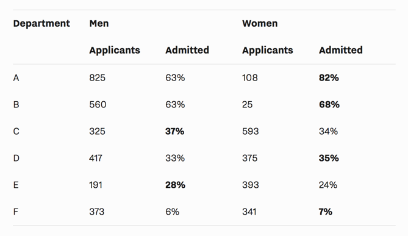
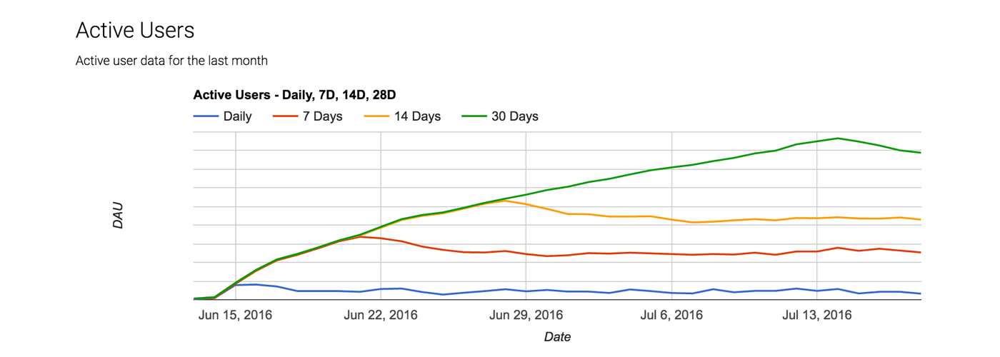
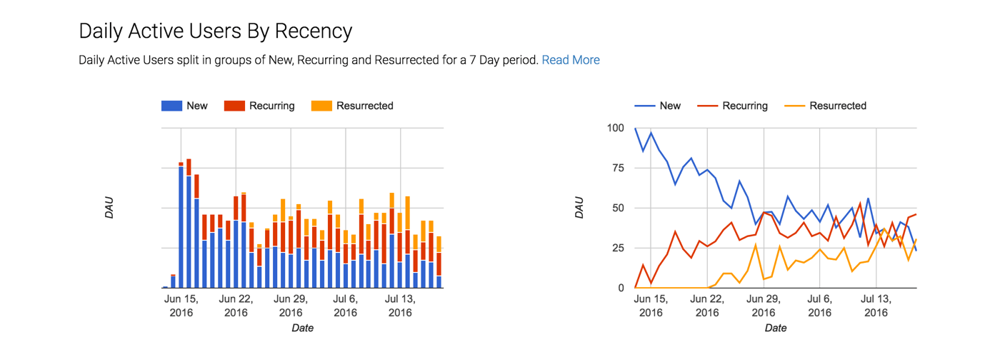
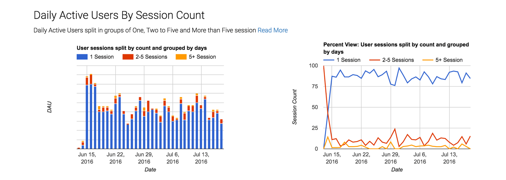
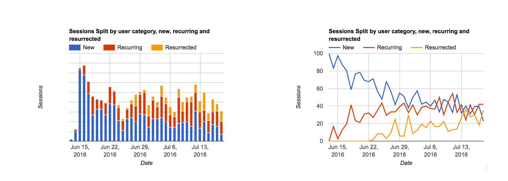

### Why you need to look at the same data from various perspectives

* * *

#### Single Perspective Fallacy

**6 Blind Men & an Elephant**

When I was a child I was told a story, the story of 6 blind men and an Elephant. It went something like this:

> A number of blind men came across an animal. Somebody told them that it was an elephant. The blind men asked, ‘What is an elephant like?’ and they began to touch its body. One of them said: ‘It is like a pillar.’ This blind man had only touched its leg. Another man said, ‘The elephant is like a husking basket.’ This person had only touched its ears. Similarly, he who touched its trunk or its belly talked of it differently.

None of the men were wrong, but none of them were right either. They were right in their own little observation. One can come across the same problem when one is looking at data. If you were just looking at Twitter revenue between [2014 and 2015](https://www.wolframalpha.com/input/?i=twitter+revenue), Twitter was a growing company. But once you look at the User Growth, it is a whole different story.

**Simpson’s Paradox**

In almost all cases, when we as data analyst come across a break in the trend or an interesting observation, we have the urge to investigate and answer the question why. In 1973 P. J. Bickel, E. A. Hammel, J. W. O’Connell also came across a similar observation at the University of California, Berkeley. They noticed that 44% of the men who applied were being admitted when compared to 35% of women, a possible indication of gender bias.

Admission Percentages

So they set out to investigate this by individual department, but interesting found that this was not the case. In Fact, 4 of the top 6 departments were biased towards women.

So what happened here? What we just saw was an example of Simpson’s Paradox, which states “a trend appears in different groups of data but disappears or reverses when these groups are combined”. This does not mean we should not drill down, we just just be aware that their may be such discrepancies and more importantly not make any assumptions on the the data as a whole.

* * *

#### Why different perspectives matter

A month ago, the world experienced Brexit. 51.89 % of UK voted to leave the EU. Which seems close, but once you change the perspective, you see a whole different point of view:

While this was just an exit poll, it does give us a whole different perspective of Brexit.

Update: as of 2011 UK census, 48% of the population comes under the age bracket 15–49 and 35% are over 64. So one can assume most of the young folks voted to leave.

#### Different perspectives of your product’s growth.

Often we keep looking for tools which will magically tell us what works and what does not, our own version of 10 friends in 7 days. Unfortunately we miss many of the simple signs in-front of us. Something as simple as a DAU can give us so much data if we look at it from a different perspective.

Here is an example of an Active User graph.

Active Users

The first thing we notice that DAU growth is stagnant.

But if we split the DAUs by user’s recency, we notice that the App is pretty sticky, close to 50% of the users comeback within 7 days & 25% come back after 7 days, and the percentage of users is just growing. So they are seeing value.

DAUs split by recency

Next if we split the DAUs by sessions per day, we see that most users have only 1 session per day, but you have a consistent percentage of users having more than 2 sessions each day, albeit a small amount.

DAUs by session count

If we look at the session data, we again notice that most of the sessions are driven by repeat usage, both within 7 days (recurring) & post a gap of 7 days (resurrected users), which just goes to show that the App has found a good product market fit and just needs to solve the growth issues.

Session split by recency

All this just from looking at DAUs and sessions from different perspectives.

Have you been looking at your data in the same way? We would love to know. Do comment below.

* * *

Photo credit: [Philippe Put](https://www.flickr.com/photos/34547181@N00/11552703254/) via [Foter.com](http://foter.com/) / [CC BY](http://creativecommons.org/licenses/by/2.0/)
