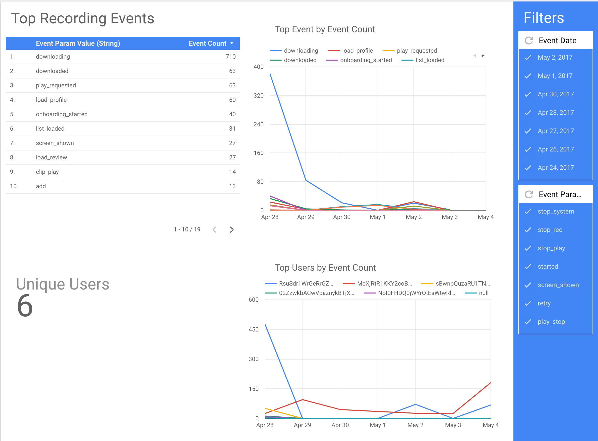
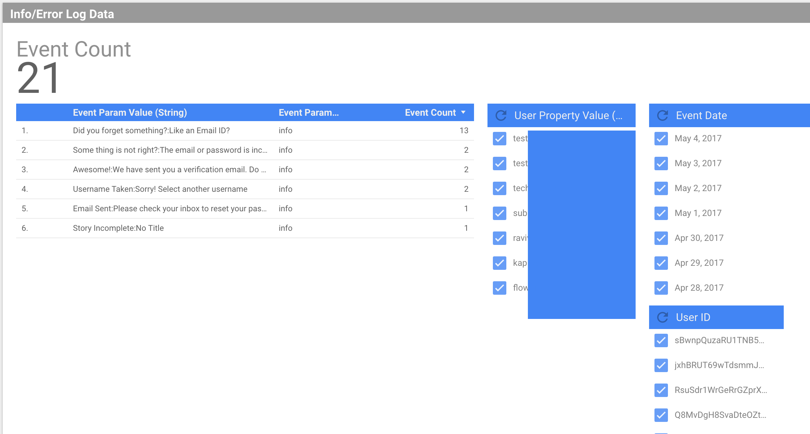

_Knowing what is happening in your App is critical for an App to Grow. As the famous saying goes: “What can’t be measured can’t be improved”_

Analytics can get very expensive very quickly. [Google](https://hackernoon.com/tagged/google) Analytics Premium costs $150,000 a year, pricing for most other tools start at more than a $1,000 a month. While all the tools have generous free tiers, they are also crippled when it comes to features. Bootstrapped startups can’t afford such plans, but do want access to power [tools](https://hackernoon.com/tagged/tools). This was one of the reasons we started our old company PureMetrics, but the market is already crowded and the Biggies are throwing their weight around, by providing Analytics as a feature for their Cloud products. Overall it is good for the ecosystem as it lowers the cost for everyone.

This post will dive into using Data Studio, BigQuery and Firebase to get your analytics done close to free.

First things first, I usually advise against “rolling your own” Analytics from Scratch. Basically if someone tells you they can have their own MYSQL or Mongo instance to log events, don’t listen to them. They plan to only solve part of the problem, storage, and have not thought about how data will be pushed to the server and how it will be queried.

An Analytics system can be broken down into 3 main components:

— Ingestion

— Storage

— Query

We are going to use the following for the 3

- Firebase Analytics for Ingestion
- BigQuery for Storage, can be used to query too
- DataStudio for Querying & Visualization

**Firebase Analytics**

The next question in your mind would be, why are we not using Firebase Analytics as is? Firebase Analytics is pretty weak when it comes to querying. You can’t even see all your event parameters on the Analytics Dashboard ( I don’t think it will improve too, as then people won’t move the data to Bigquery). Its super power is getting our events data into BigQuery for close to zero cost.

**BigQuery**

BigQuery is a full managed SQL DB provided by Google. I love it for 3 reasons:

- It is fully managed, No DevOps required, Don’t worry about sharding, hotkeys or indexes.
- It is FAST!
- It is cheap. Querying 1 TB of data costs $5, with the first TB every month being free

**Data Studio**

Data Studio is a relatively new BI service provided by Google, which is Free to Use and easy to get started with. It does have a few issues, like only being able to work with a single table at a time, but it is not a show stopper, specially as we can merge tables in BQ, or create views to simplify the table structure

With this setup you need to integrate the firebase SDK in your apps to start passing events, and enable the Blaze plan to start pushing the analytics data into BQ. Once this is done you can start using data studio to build simple reports and share them with your organisation. If you have never used a BI tool before, it might take some getting used to but once you do, it will be a breeze to create reports. Here is a super simple report for our Alpha builds.

## Some advantages of this setup

- Create advanced reports by merging data from various other sources, like a CSV file, Google AdWords or your own MySQL DB
- Fully managed, think about it, No DevOps, you don’t need to worry about how large your machines are, or loadbalancers, or have pagers to wake you up at 3:00 AM. If you are touting the throughput of your system, and the system is not the main product you are selling you are doing it wrong.
- Easy for analysts to get started with as they already know how to use BI tools. BI tools also take advantage of filters, which update the entire view when you use a filter.
- BQ is fast, very fast. This allows you to query trends from years of historical data. You can read more [here](https://cloud.google.com/blog/big-data/2016/01/anatomy-of-a-bigquery-query), where they query 4 TB of data in 30 seconds
- Firebase captures some events automatically, like First\_open, app\_updated etc
- You can pretty much build any kind of report if you are willing to get your hands dirty with SQL. You are not bound by typical querying mechanisms which almost always start with “users who have done or not done X”

## Disadvantages

- Firebase Analytics does not have a web SDK \[Update: [they do now](https://firebase.google.com/docs/reference/js)\] (They probably never will, as it will pretty much Kill GA Premium). So you can’t get your site data. Alternative you can use Segment instead of Firebase Analytics. The table structure Segment provides is also more easier to work with. It is relatively more expensive, but still cheaper than the other tools as you can start ingesting data from other sources into BigQuery
- As I mentioned in the previous point, the table structure of firebase is not the best, it takes maximum use of the BQ repeated records, but if you plan to use other sources, you will have more work to do
- If you are on AWS this setup is pretty much Dead on arrival. You can build a similar set up with AWS mobile hub, or use the independent services directly, which are AWS Mobile analytics, Redshift and QuickSight.
- Charts like cohorts are not available out of the box, but can be built, SQL for most charts is available on the InterWebs
- You don’t get email reports with DataStudio.
- Realtime reports are also going to be challenge. Firebase creates IntraDay tables for the current day’s data. Thus you can’t merge the data directly. Then again, do you really need real time analytics? Are you reacting in realtime? if not you don’t need real time analytics.
- Firebase pushes the data from iOS and Android into different tables. Events and user properties are also pushed into different tables. So you would need to run joins or build views if you need to merge the data. If this is too much, Segment is a better option
- There is a limit on the length of names and values, and depending on what you are doing, it can be an issue. From the Firebase documentation:

> You can report up to 500 different types of Events per app Each event can associate up to 25 unique parameters Event and Param names can be 40 characters long You may supply up to 25 unique UserProperties per app. Names can be up to 24 characters long and values 36 characters

This is the exact setup we have at Odiocast. For the website we are using Segment to pass the data to BigQuery once in a day. From there we use multiple reports on Data studio to see who is doing what on the Alpha apps.

As a bonus, since Firebase is acting as a pipe to BigQuery, We also pass error and info logs when needed. On iOS I am cheating a little and passing message strings of my alert boxes

info logs
