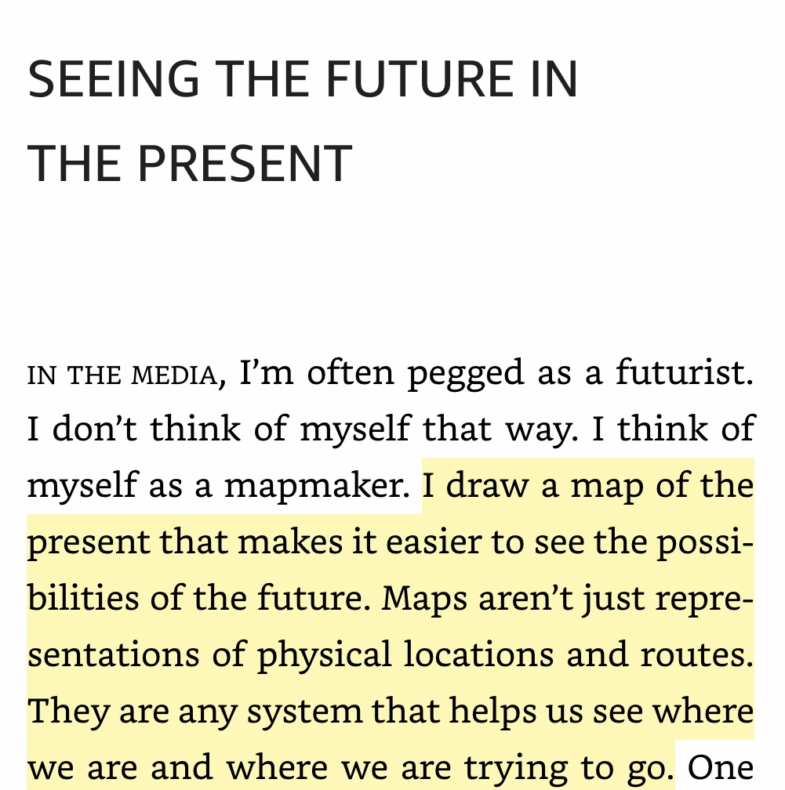

The last 2-4 months I have been stuck with a few concepts like [Zooming in and zooming out](https://ravivyas.com/2018/07/17/zooming-in-and-zooming-out/), [breaking problems down](https://ravivyas.com/2018/08/31/breaking-problems-down/). While the concepts are important my interpretations of them are very crude in retrospect. I say that because I believe what I have tried to encompass in 2 blog posts with more on the way, Tim O'Reilly of O'Reilly Media sums it up in 2 lines

Here is a snippet from his book [WTF? What’s the Future and Why It’s Up to Us](https://www.oreilly.com/tim/wtf-book.html)

The Concept of Maps is such a brilliant Idea. It encompasses both the concepts I previously wrote about. Zooming in and Zooming out requires that you actually build a map of your Organization. Breaking problems down is actually one of the requirements for building maps.

As you grow the concept to suit your need, you can always add more layers to your map, layers like strengths & weakness, Past, Present, and Future.

This also showcases the importance of MindMaps as both a technique and a tool, because they are one of the easier ways to visualize such maps.
