_This is a part of my “_[_Journey with Azure_](https://ravivyas.com/tag/journey-with-azure/)_” series_

I have always been fascinated by managed services and serverless computing. It started with my first startup PureMetics, where we used AppEngine and BigQuery to built an Analytics product. Because both AppEngine and BigQuery were fully managed services, A single person (@Abhishek Nandi) was able to build the entire tech for it. Later on when Abhishek & I were building Odiocast, we used other managed services to keep things simple. FireBase, AWS Lambdas and other services allowed us to worry more about the product rather than worry about Devops as a 2 person startup.  

The logic is simple when you have the best technology companies willing to be your Devops team, at a cost, why would you say no? You would then have time to focus on what makes your product different. Also since all of the providers are running at scale, they get to reap scale benefits which they pass on to you. Today I am practically running a side project for almost nothing on GCP and my next project is also going to be close to free on Azure.

## **Abstraction of Operation**

Managed services abstract out service management and scaling. They vary from just abstracting out the basics like infrastructure i.e Infrastructure as a Service (IaaS) providers like AWS EC2, to abstracting out all details i.e Functions as a Service (FaaS) like Azure Functions

### **Levels of Abstraction**  

Depending on your needs you can pick services between the 3 abstraction types.  
IaaS, PaaS & Faas  

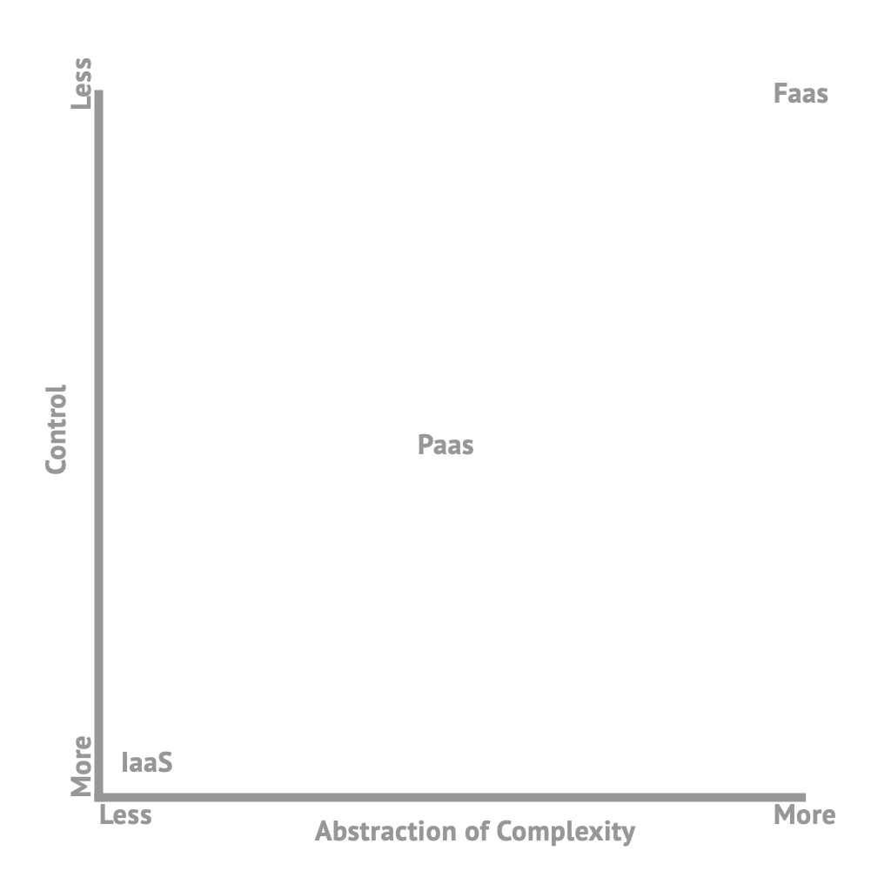

### **Additional Abstraction**   

Azure Functions take abstraction to a whole new level with [Bindings](https://docs.microsoft.com/en-in/azure/azure-functions/functions-triggers-bindings). With Bindings, Azure Functions allow you to connect a bunch of services without writing additional code for it. It achieves this by abstracting out the service like Table Storage, Queue Storage etc and providing you objects to refer to the service. With Bindings, you are actually writing the least amount of code to connect 2 services. More on this later.

## **Azure Functions**  

While AWS Lambda was the pioneer in FaaS, almost all service providers now have equivalents. Personally, Azure Functions are the most interesting service for me because of the additional abstraction layer it provides via Extensions and Logic Apps.

## **Getting Started with Azure Functions**   

There are many ways to build an Azure Function, you can write an Azure Function in various languages (C#, JS, Java, Python), which then provide you the option of using Visual Studio, Visual Studio Code, the Azure Portal or Any other editor to write it.  For this tutorial, I am going to be using VSCode and JavaScript to build my function. 

### **Step 1. Create a new Functions Resource**  

Head over to the Azure Portal and select Create a Resource (1) and then select Serverless Function App (2)  

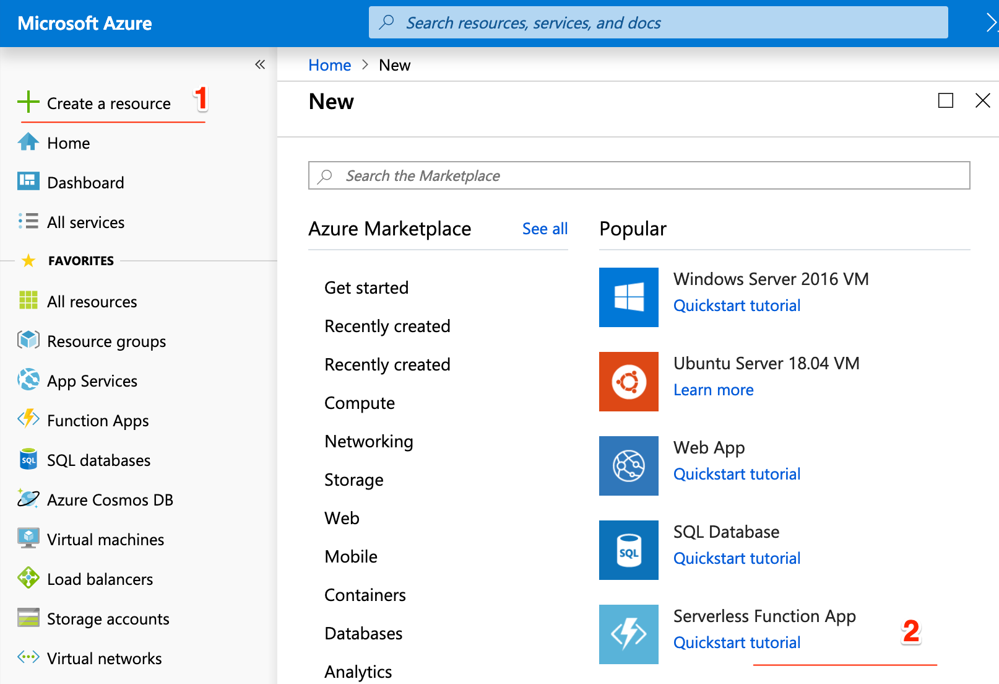

Next the next Blade you can name your app (3), select subscription (the billing account) and the hosting plan and OS amongst other things. These are important choices. For example, Python is only available on Linux, and Linux is only available in a few regions. The important option here is the hosting plan (4). You have 2 options here:   

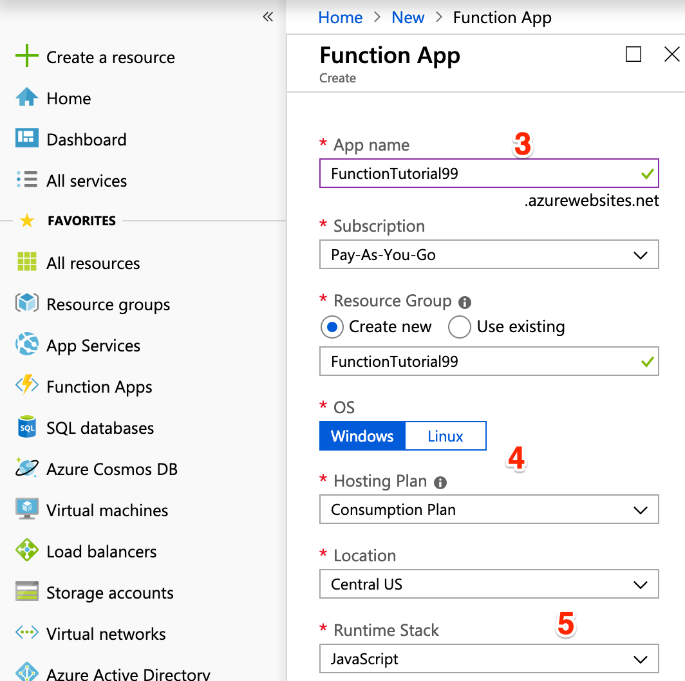

1. Consumption plan: Here you only pay for the number of times your function is run
2. App Service Plan: Here your function run on a dedicated VM run on an App Service, which will cost extra but will be useful in a few cases which are documented [here](https://docs.microsoft.com/en-us/azure/azure-functions/functions-scale#app-service-plan). 

If you are just starting up with Azure Functions, Consumption plan is the way to go.  

Lastly, select the Runtime stack (5), I selected Javascript for this tutorial.

Press create, this will take a while. The portal will first validate things and then close the blade. Don’t worry this is normal. 

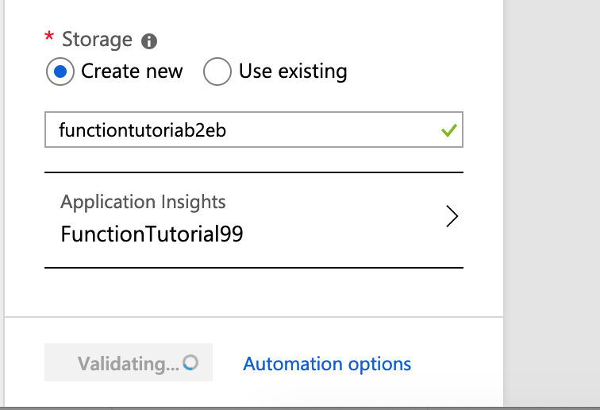

You will need a notification pop up which would state that the deployment is in progress.

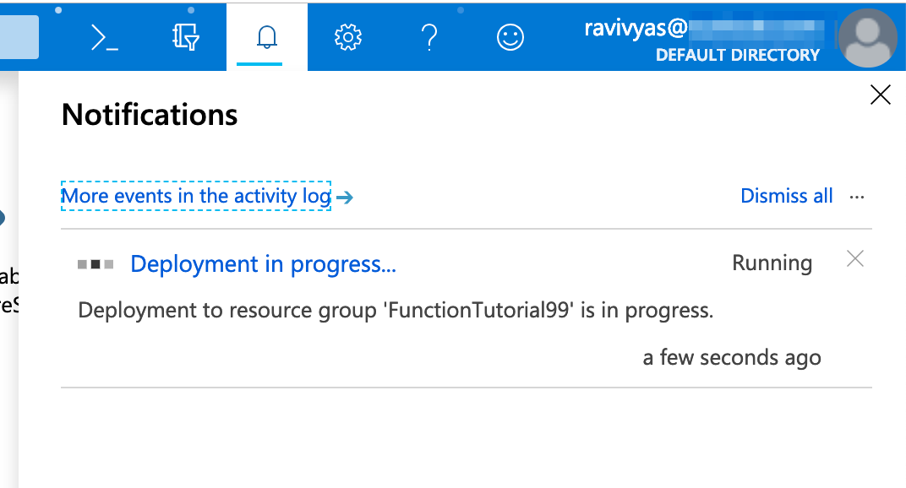

Side note: One thing you start noticing is the options/flexibility Azure Functions provides. You will see in the next step too.  
Once the deployment is done head over to the Functions Resource, you will see the following screen

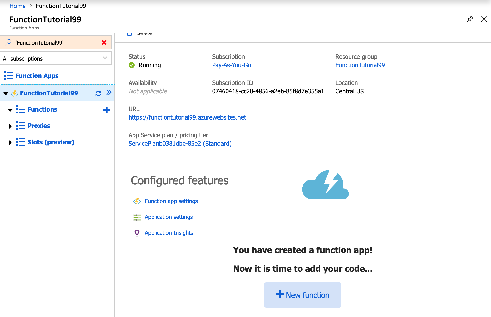

Go ahead and click on new functions. Depending on the options you selected you will see different options. For my selected options I see the following 

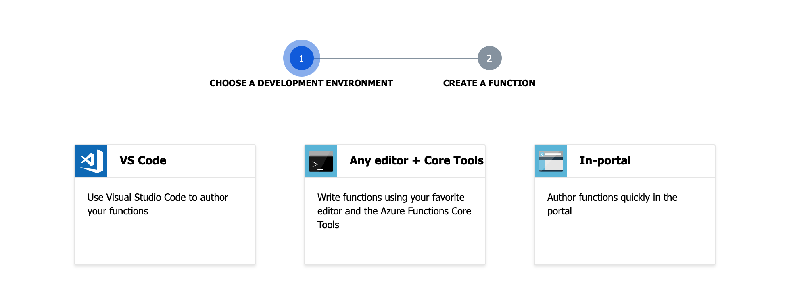

Once again for this tutorial, I will select VS Code, post which I am shown two options, publish using VS code or via the Deployment Centre. I will select Direct publish  

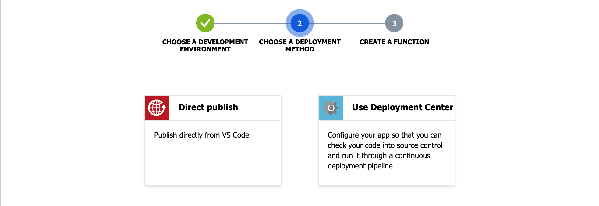

### **Step 2 Install various dependencies** 

This then gives you the steps to install the following dependencies

- [Visual Studio Code](http://bit.ly/2CuVaVw)
- [NodeJS & NPM](http://bit.ly/2TXZoiB)
- [Azure Functions Core Tools](http://bit.ly/2U4WEQl) which needs [.NET Core 2.1](http://bit.ly/2Yb8oQy)
- [Azure Functions for VS Code](http://bit.ly/2Ybmwct), once this is installed you also need to sign into Azure.

### **Step 3: Getting started on VS Code**

Once all of them are installed, we need to move over to VS Code to get started. Open up the Azure panel on VS Code (1), You will see a Functions section, with your subscription plan and your functions plan, select it (2)

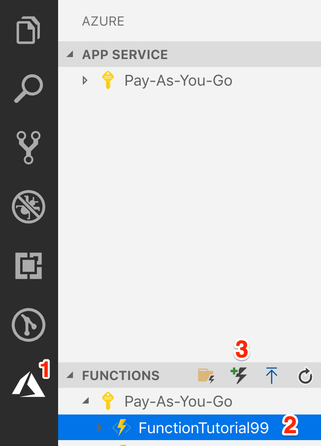

Lastly, click the new Functions button (3) . Now VSCode will first ask you for a location and then will ask you to initialise the project, yes is the obvious selection.  
VScode will take you through a wizard to create your functions app,   

1. Select the language - Javascript 
2. Select the function template - Since we are just getting started, Select the simplest, HttpTrigger
3. Select the default name provided _HttpTrigger_
4. Authorisation Level will be Anonymous
5. Lastly, add it to a workspace of your choice

For now, just remember triggers are events which cause the function to run, we will take a deeper dive into trigger later  
Next VSCode will open up the function file index.js, if you don’t see a folder like I do below, open the folder you created during the steps above  

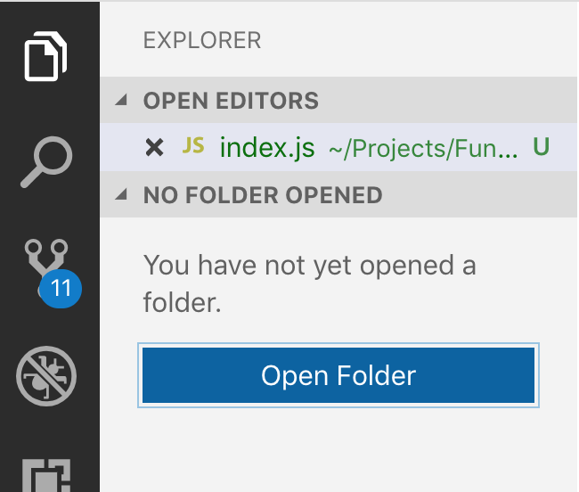

Now you should see your folder like this 

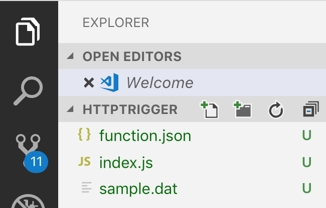

Two files which are important are the function code in _index.js_ and the _function.json_ file which defines the bindings for this function. 

### **Index.js**

This is the code of your function. The arguments of the function vary based on the type of trigger you are using. The HTTP trigger will have a context object and a request object. Azure Functions use the context object to communicate with your function. For example, if you had an output binding you would refer it via the context object using _context.bindings.<name of binding>._

In case of the HTTP Trigger we also get the http request as an argument. 

### **Function.json**  

This Json file defines the input and output bindings of your function. In case of our example, both of them are going to be HTTP bindings. More on bindings later. 

## **Running the Function**  

To run your function press F5, Your console in VSCode will show something like this   

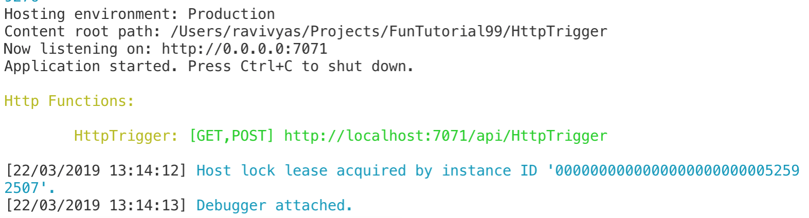

If you call the URL without any request parameters you will get the following message   

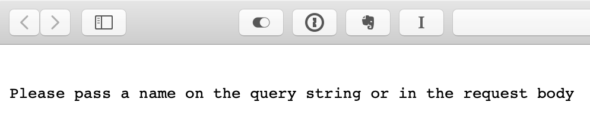

Just pass a name as a get parameter, like this: [http://localhost:7071/api/HttpTrigger?name=Ravi](http://localhost:7071/api/HttpTrigger?name=Ravi)  

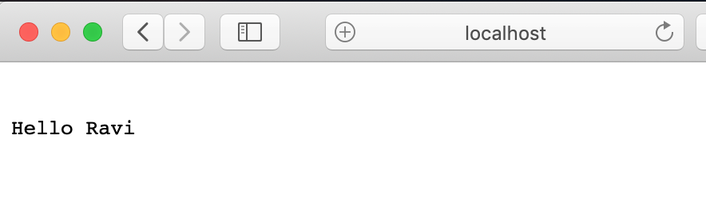

## **The tutorial works, what next?**

Function are great at doing stuff when something happens, a trigger. They are ideal for microservices or workers which do a particular job. Here are a few examples   

1. Use a timer trigger to hit an API ever 24 hours and store the response in a table, for example you can hit the Nasa Near Earth Object Web Service to get the count of near earth objects daily
2. Use a HTTP trigger to hit an API with some parameters and store the response in queue & process it with another function
3. Read a log file and pass error events into a queue to be processed 
4. Use a HTTP trigger to pass an upvote to a queue and then use a function to increment the vote up in an asynchronous manner
5. Store a profile picture in Storage and use a storage triggered function to generate a thumbnail image and store it

## **Diving Deeper into Triggers & Bindings**

Triggers at the simplest are events which trigger your function to start. They may also have information with them. A HTTP trigger, as we saw above, has the http request data passed to your function, a queue trigger will have the object from the queue. They are passed as arguments to your function. As such a function can only have one trigger but can have multiple input bindings. 

### What are bindings?  

Bindings allow your function to connect to various resources without the need of writing a lot of code for the service. Without bindings, you would need to add the SDK of the service you want to use, write all the boiler plate for it and then start using it, with bindings, Azure Functions do the heavy lifting for you. As mentioned above, bindings are available for you to use via the context objects.   

### Declaring Triggers and Bindings  

Depending on how you are writing your functions. Since we are using Javascript we need to update the _functions.json_ file, if you were using C# you would need to decorate methods and parameters with C# attributes. The Azure Portal has a Wizard/GUI mechanism.  

When you declare the binding you will need to define the following:   

1. Name
2. Direction - Can be in, out, there is also a special inout direction
3. Type

The rest of the parameters depend on the type of binding you are using. If you are using Tables or Queues, for example, you need to provide the storage account, and the name of the Queue or Table you want to use.

Here is an example of a _function.json_ file. Here I am reading a queue which has a list of JSON objects, the function then reads in the individual objects and pushes them to the output-queue-individual queue and it’s metadata to output-queue-meta.

```
{
  "disabled": false,
  "bindings": [
    {
      "name": "myQueueItem",
      "type": "queueTrigger",
      "direction": "in",
      "queueName": "queue-input-list",
      "connection": "AzureWebJobsStorage"
    },
    {
      "type": "queue",
      "direction": "out",
      "name": "outputqueuemeta",
      "queueName": "output-queue-meta",
      "connection": "AzureWebJobsStorage"
    },
    {
      "type": "queue",
      "direction": "out",
      "name": "outputqueueindividual",
      "queueName": "output-queue-individual",
      "connection": "AzureWebJobsStorage"
    }
  ]
}
```

  
When you are developing locally, the connection string is best defined in the _local.settings.json_ file. 

For a complete list of possible triggers and bindings refer [this](https://docs.microsoft.com/en-us/azure/azure-functions/functions-triggers-bindings#supported-bindings) document. 

You now know enough to get started with Azure functions.
