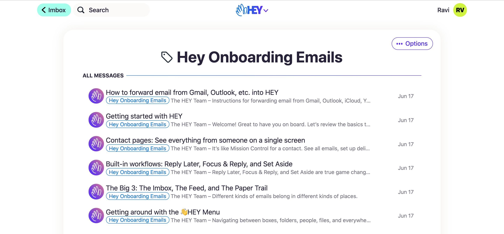
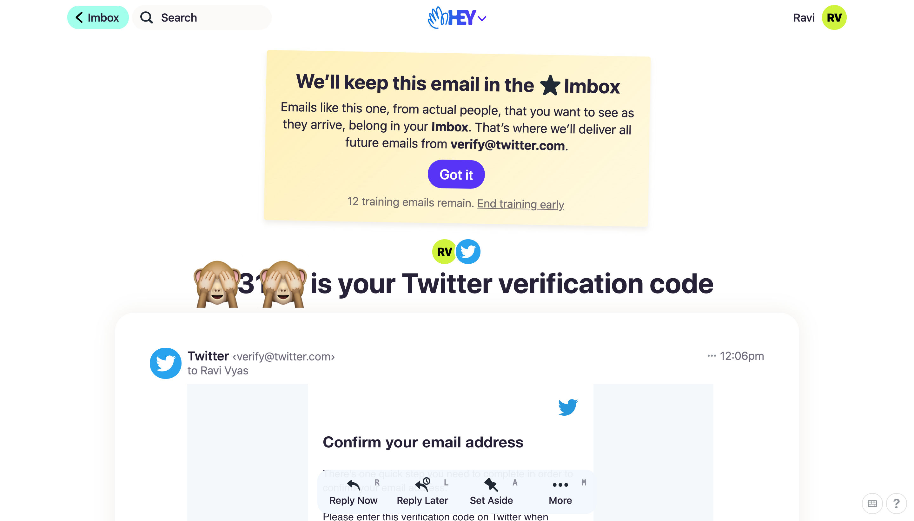
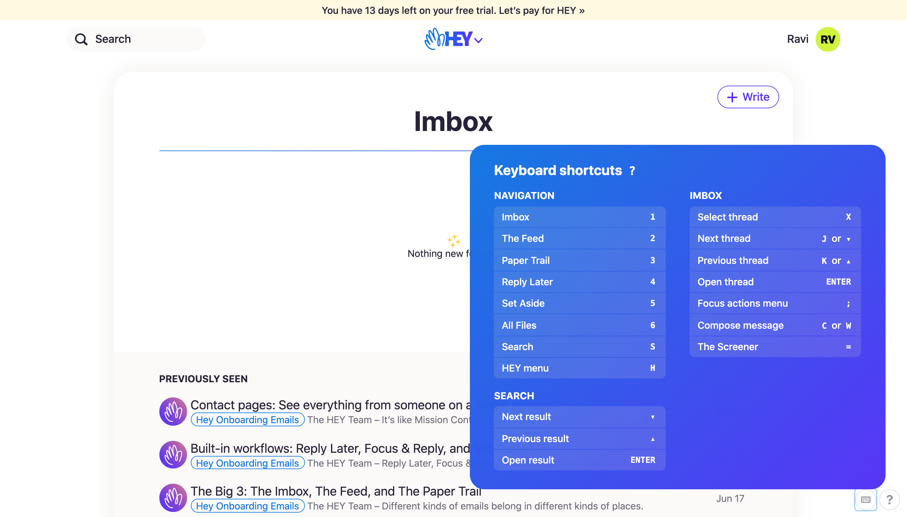
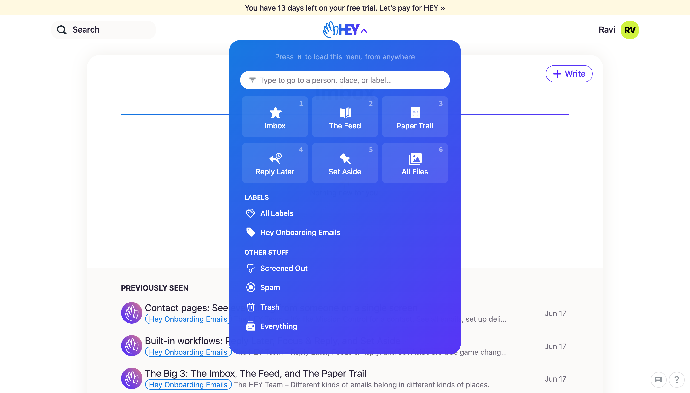

‪I got access to hey.com yesterday. I went from meh another service to “oh shit I got it”, biases are so hard to beat. Now to the product.

## Product Craft

A lot has been discussed on the product already. I am not touching the popular topics.

‪The folks over at Basecamp have put so much thought into Hey. They have not assumed anything on the part of the user, to the extent they have this elaborate onboarding tutorial, which spreads across emails and hints, which works for non-power users. 

For the power users, you have keyboard shortcuts and quick menus.

> Hey has no resemblance to any other email client/service. There is **no left navigation bar, no settings panel, no signature selector**.

## Simplify, over, and over again!

To understand why they removed so many “features,” you need to understand the concept of simplicity. Hey has all the things that one would need to start, nothing more, nothing less. 

You do not need a left menu bar; instead, you use Search and email groups like imbox, newsfeed, etc. What is left is a crisp, focused reading experience. I have been forwarding emails to my Hey account just to read them =\]

Even the unnecessary dopamine hit of unread count does not exist

Bye Unread Count

For long, we tried to solve the complexity of email by trying to help users get to Inbox zero. But we never understood the real problems of email. What generates a high volume of emails, and how do we reduce the user’s cognitive load? 

From labels to bundles and rules, many have tried to solve it. Google Inbox’s Bundle was the winner personally, but then Google killed Inbox :/.

What sells the service to me, is the attempt to simplify email for me, rather than duct tape the problems over with new features and more powerful weapons of mass deletion and triage.

## Opinions matter.

If you have read anything by the basecamp folks, you know they are opinionated. Their opinions drive them, which is a good thing. If you have strong opinions, over time, you realize, to have the right opinion, you need to have its purest version. It can’t be a 1-page value statement. 

Hey comes from their opinions 

### On Signatures

https://twitter.com/dhh/status/1230988027930873857

### On Spy Pixels

https://twitter.com/dhh/status/1225511250316144651

### On Spam filtering

https://twitter.com/dhh/status/1232677623785852929

> Strong opinions can become a rallying cry, which is good for growth ;)

## Open question

An open question I have is, why build a service rather than a client, superhuman is a client on top of other email services. They have mentioned this on the site

> **A platform, not a client**
> 
> To make significant, meaningful upgrades to email, you need to build your own platform. That’s why HEY isn’t an app that sits on top of Gmail, Outlook, iCloud, Yahoo, etc. HEY is a full email service provider. You don’t use HEY to check your Gmail account, you use HEY to check your HEY account. It’s its own platform, and it’s all you’ll need.
> 
> **Start fresh**
> 
> People’s first instinct is to bring their entire email history with them wherever they switch to a new email service. But that’s a major liability, and 99% of it is dead weight. HEY doesn’t import email from other services because we believe a fresh start is a blessing, not a curse. A moment to cut ties with the past and start again. A new house with new furniture, not one packed with all your old crappy stuff from college.

Besides, there is long term advantage of not offloading any part of the experience to another service. But as I debate this point internally, I realize any step in this direction would have been a step away from simplicity.
